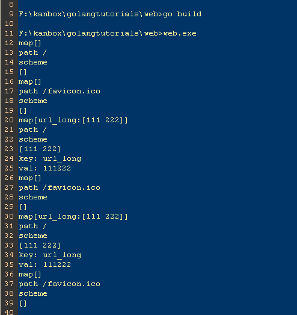

# 3.2 Go 建立一個 Web 伺服器

前面小節已經介紹了 Web 是基於 http 協議的一個服務，Go 語言裡面提供了一個完善的 net/http 套件，透過 http 套件可以很方便的建立起來一個可以執行的 Web 服務。同時使用這個套件能很簡單地對 Web 的路由，靜態檔案，模版，cookie 等資料進行設定和操作。

## http 套件建立 Web 伺服器

```Go
package main

import (
	"fmt"
	"net/http"
	"strings"
	"log"
)

func sayhelloName(w http.ResponseWriter, r *http.Request) {
	r.ParseForm()  //解析參數，預設是不會解析的
	fmt.Println(r.Form)  //這些資訊是輸出到伺服器端的列印資訊
	fmt.Println("path", r.URL.Path)
	fmt.Println("scheme", r.URL.Scheme)
	fmt.Println(r.Form["url_long"])
	for k, v := range r.Form {
		fmt.Println("key:", k)
		fmt.Println("val:", strings.Join(v, ""))
	}
	fmt.Fprintf(w, "Hello astaxie!") //這個寫入到 w 的是輸出到客戶端的
}

func main() {
	http.HandleFunc("/", sayhelloName) //設定訪問的路由
	err := http.ListenAndServe(":9090", nil) //設定監聽的埠
	if err != nil {
		log.Fatal("ListenAndServe: ", err)
	}
}
```

上面這個程式碼，我們 build 之後，然後執行 web.exe，這個時候其實已經在 9090 埠監聽 http 連結請求了。

在瀏覽器輸入`http://localhost:9090`

可以看到瀏覽器頁面輸出了`Hello astaxie!`

可以換一個地址試試：`http://localhost:9090/?url_long=111&url_long=222`

看看瀏覽器輸出的是什麼，伺服器輸出的是什麼？

在伺服器端輸出的資訊如下：



圖 3.8 使用者訪問 Web 之後伺服器端列印的資訊

我們看到上面的程式碼，要編寫一個 Web 伺服器很簡單，只要呼叫 http 套件的兩個函式就可以了。

>如果你以前是 PHP 程式設計師，那你也許就會問，我們的 nginx、apache 伺服器不需要嗎？Go 就是不需要這些，因為他直接就監聽 tcp 埠了，做了 nginx 做的事情，然後 sayhelloName 這個其實就是我們寫的邏輯函數了，跟 php 裡面的控制層（controller）函式類似。

>如果你以前是 Python 程式設計師，那麼你一定聽說過 tornado，這個程式碼和他是不是很像，對，沒錯，Go 就是擁有類似 Python 這樣動態語言的特性，寫 Web 應用很方便。

>如果你以前是 Ruby 程式設計師，會發現和 ROR 的/script/server 啟動有點類似。

我們看到 Go 透過簡單的幾行程式碼就已經執行起來一個 Web 服務了，而且這個 Web 服務內部有支援高併發的特性，我將會在接下來的兩個小節裡面詳細的講解一下 Go 是如何實現 Web 高併發的。

## links
   * [目錄](<preface.md>)
   * 上一節：[Web 工作方式](<03.1.md>)
   * 下一節：[Go 如何使得 web 工作](<03.3.md>)
