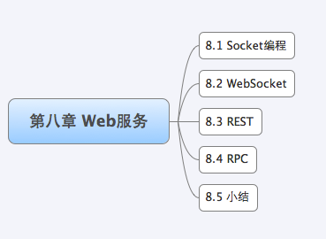

# 8 Web 服務
Web 服務可以讓你在 HTTP 協議的基礎上透過 XML 或者 JSON 來交換資訊。如果你想知道上海的天氣預報、中國石油的股價或者淘寶商家的一個商品資訊，你可以編寫一段簡短的程式碼，透過抓取這些資訊然後透過標準的介面開放出來，就如同你呼叫一個本地函式並回傳一個值。

Web 服務背後的關鍵在於平臺的無關性，你可以執行你的服務在 Linux 系統，可以與其他 Windows 的 asp.net 程式互動，同樣的，也可以透過同一個介面和執行在 FreeBSD 上面的 JSP 無障礙地通訊。

目前主流的有如下幾種 Web 服務：REST、SOAP。

REST 請求是很直觀的，因為 REST 是基於 HTTP 協議的一個補充，他的每一次請求都是一個 HTTP 請求，然後根據不同的 method 來處理不同的邏輯，很多 Web 開發者都熟悉 HTTP 協議，所以學習 REST 是一件比較容易的事情。所以我們在 8.3 小節將詳細的講解如何在 Go 語言中來實現 REST 方式。

SOAP 是 W3C 在跨網路資訊傳遞和遠端計算機函式呼叫方面的一個標準。但是 SOAP 非常複雜，其完整的規範篇幅很長，而且內容仍然在增加。Go 語言是以簡單著稱，所以我們不會介紹 SOAP 這樣複雜的東西。而 Go 語言提供了一種天生效能很不錯，開發起來很方便的 RPC 機制，我們將會在 8.4 小節詳細介紹如何使用 Go 語言來實現 RPC。

Go 語言是 21 世紀的 C 語言，我們追求的是效能、簡單，所以我們在 8.1 小節裡面介紹如何使用 Socket 程式設計，很多遊戲服務都是採用 Socket 來編寫伺服器端，因為 HTTP 協議相對而言比較耗費效能，讓我們看看 Go 語言如何來 Socket 程式設計。目前隨著 HTML5 的發展，webSockets 也逐漸的成為很多頁遊公司接下來開發的一些手段，我們將在 8.2 小節裡面講解 Go 語言如何編寫 webSockets 的程式碼。

## 目錄
   

## links
   * [目錄](<preface.md>)
   * 上一章：[第七章總結](<07.7.md>)
   * 下一節：[Socket 程式設計](<08.1.md>)
